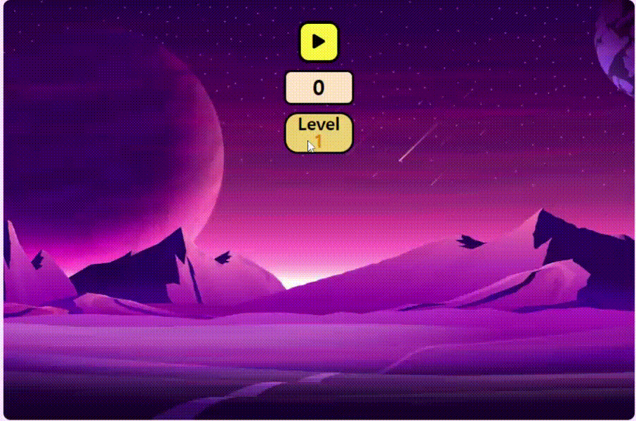

# Alien을 잡는 게임

 
 

---

- ## <a href="https://memore2.github.io/alienCatchingGame/" target="_blank">게임 링크</a>

---

## 🧨 **게임방법**

- ### 외계인이 나오면 클릭해서 없앤다.

* ### 일정 시간동안 버티면 다음 단계로 넘어간다.
* ### 단계가 넘어갈때마다 나오는 속도가 빨라진다.

 
 
 

## ✨ **코딩하면서 어려웠던점**

> ### 처음에는 하나의 파일에 코딩을 하고 나중에 class를 사용해 모듈화를 진행했다.
>
> ### 나름 구조화를 잘 했다고 생각했으나, 모듈로 바꾸려 하니 기능별로 분류가 제대로 안되는 문제가발생했다.

 
 
 

## 🎉 **깨달은 점**

> ### 기능별로 분류해 짜는 능력이 아직 부족하다 느꼈고 단번에 모듈로 만들 수 있도록 실력을 키우고 싶어졌다.
>
> ### 꾸준히 클래스를 사용해 익숙해져야지.

 
 

## 🏀 **개선하고 싶은 점**

- ### canvas를 사용해 보다 동적인 움직임을 가지고 싶음.
- ### 음소거 기능을 만들기.
- ### UI 개선.
- ### 외계인이 못생겨서 좀 바꿔야 할 듯.
